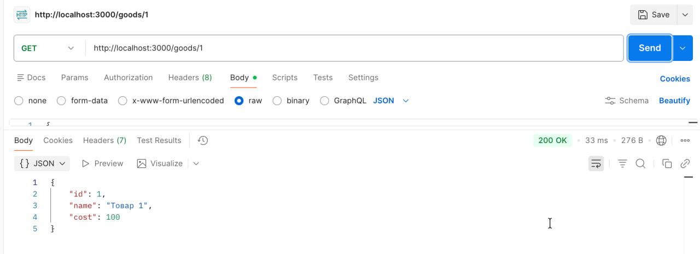
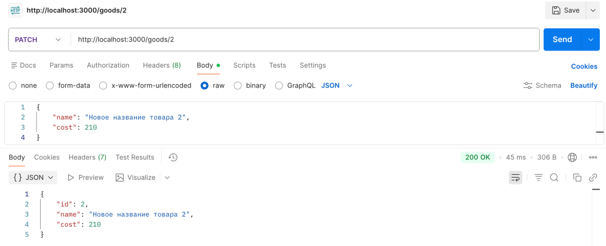
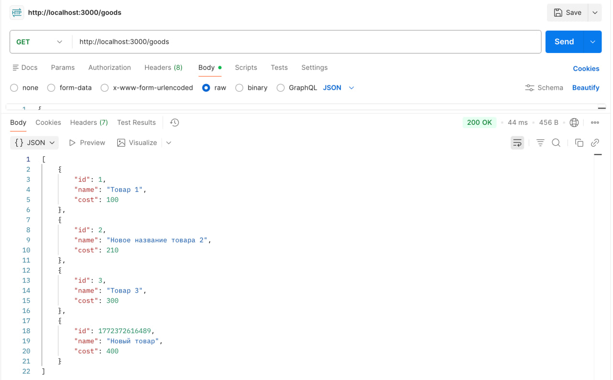
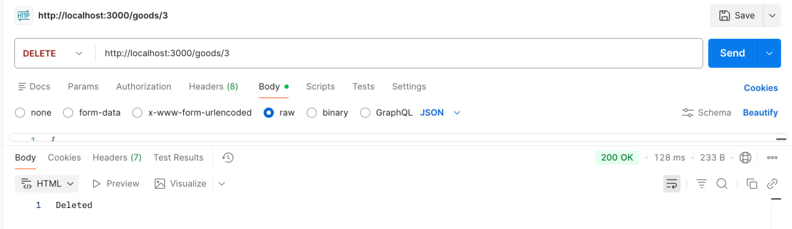
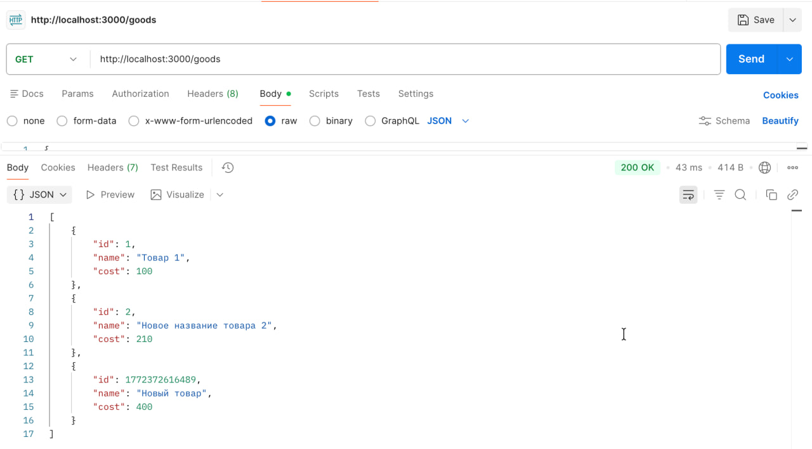
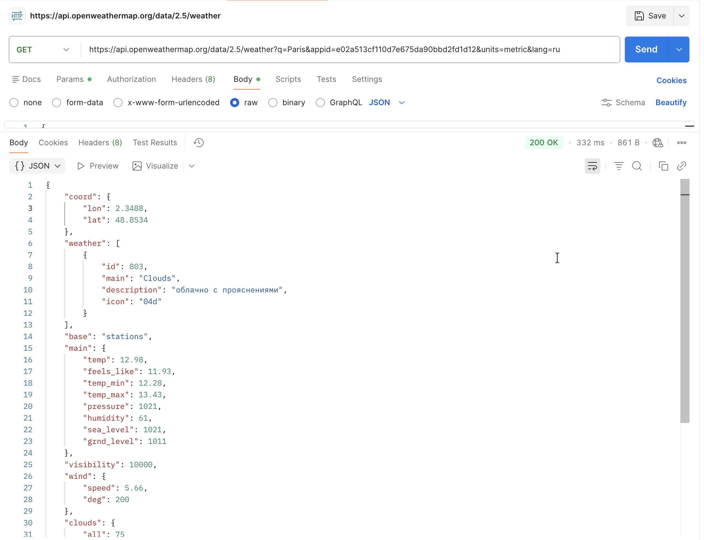
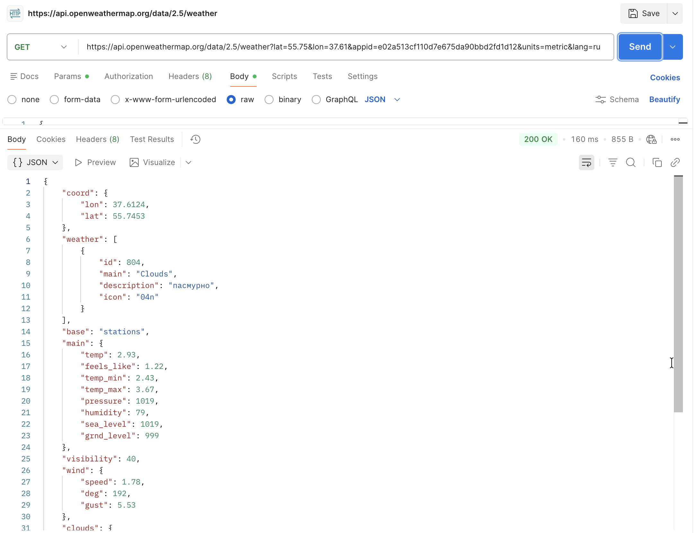
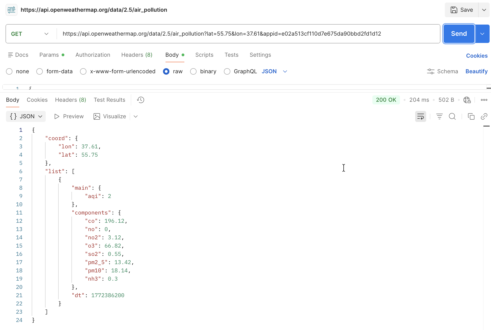
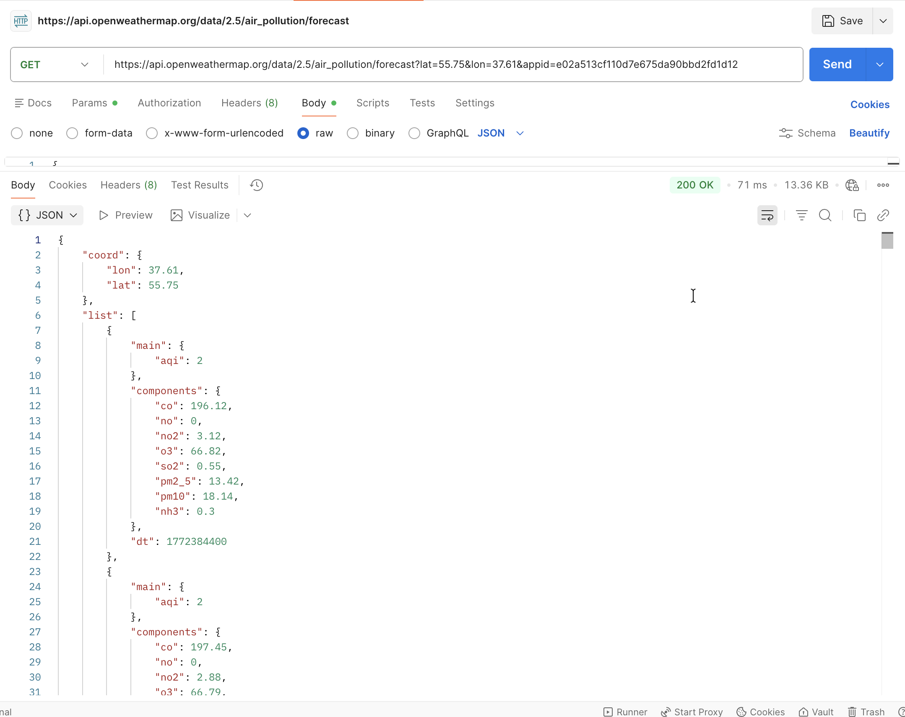
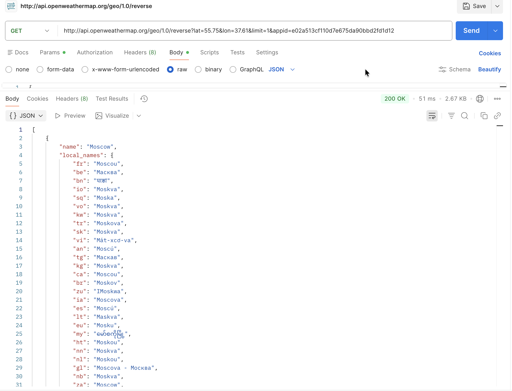

# Практическое задание №3

## Из практического задания №2: 
### GET /goods

### GET /goods/:id

### POST /goods

### PATCH /goods/:id

### DELETE /goods/:id

## Запросы к https://openweathermap.org/

### Прогноз погоды в Париже

### Прогноз погоды по координатам

### Качество воздуха

### Прогноз качества воздуха

### Нахождение города по координатам
